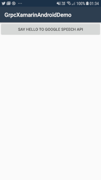

# grpc-xamarin-samples
Contains demo code showing how grpc works with Xamarin.Android

Steps:

0. You need Visual Studio 2017 and the Xamarin bits installed
1. Add the following nuget feed for package restore to work: https://www.myget.org/F/greenliff-grpc/api/v3/index.json
2. Get your own API credentials of type "service account" by registering on https://cloud.google.com/video-intelligence/docs/common/auth and saving the credentials to the file GrpcXamarinAndroidDemo/speech_auth.json
3. Build, run and deploy the application to your mobile, you should see this:

<p align="center">
  
</p>
<!------>

with the following output in the debug console after clicking the button in the app:

```
...
07-10 01:58:35.919 D/Mono    (18105): DllImport attempting to load: 'grpc_csharp_ext'.
07-10 01:58:35.922 D/Mono    (18105): DllImport error loading library '/storage/emulated/0/Android/data/GrpcXamarinAndroidDemo.GrpcXamarinAndroidDemo/files/.__override__/libgrpc_csharp_ext': 'dlopen failed: library "/data/app/GrpcXamarinAndroidDemo.GrpcXamarinAndroidDemo-OpMrUrIc9LYA7RSFBbz4Vg==/lib/arm64//storage/emulated/0/Android/data/GrpcXamarinAndroidDemo.GrpcXamarinAndroidDemo/files/.__override__/libgrpc_csharp_ext" not found'.
07-10 01:58:35.924 D/Mono    (18105): DllImport error loading library '/storage/emulated/0/Android/data/GrpcXamarinAndroidDemo.GrpcXamarinAndroidDemo/files/.__override__/libgrpc_csharp_ext.so': 'dlopen failed: library "/data/app/GrpcXamarinAndroidDemo.GrpcXamarinAndroidDemo-OpMrUrIc9LYA7RSFBbz4Vg==/lib/arm64//storage/emulated/0/Android/data/GrpcXamarinAndroidDemo.GrpcXamarinAndroidDemo/files/.__override__/libgrpc_csharp_ext.so" not found'.
07-10 01:58:35.926 D/Mono    (18105): DllImport error loading library '/system/lib/libgrpc_csharp_ext': 'dlopen failed: library "/data/app/GrpcXamarinAndroidDemo.GrpcXamarinAndroidDemo-OpMrUrIc9LYA7RSFBbz4Vg==/lib/arm64//system/lib/libgrpc_csharp_ext" not found'.
07-10 01:58:35.928 D/Mono    (18105): DllImport error loading library '/system/lib/libgrpc_csharp_ext.so': 'dlopen failed: library "/data/app/GrpcXamarinAndroidDemo.GrpcXamarinAndroidDemo-OpMrUrIc9LYA7RSFBbz4Vg==/lib/arm64//system/lib/libgrpc_csharp_ext.so" not found'.
07-10 01:58:35.931 D/Mono    (18105): DllImport error loading library 'libgrpc_csharp_ext': 'dlopen failed: library "/data/app/GrpcXamarinAndroidDemo.GrpcXamarinAndroidDemo-OpMrUrIc9LYA7RSFBbz4Vg==/lib/arm64/libgrpc_csharp_ext" not found'.
07-10 01:58:35.937 D/Mono    (18105): DllImport loaded library 'libgrpc_csharp_ext.so'.
07-10 01:58:35.937 D/Mono    (18105): DllImport searching in: 'grpc_csharp_ext' ('libgrpc_csharp_ext.so').
07-10 01:58:35.937 D/Mono    (18105): Searching for 'grpcsharp_redirect_log'.
07-10 01:58:35.937 D/Mono    (18105): Probing 'grpcsharp_redirect_log'.
07-10 01:58:35.937 D/Mono    (18105): Found as 'grpcsharp_redirect_log'.
07-10 01:58:35.940 D/Mono    (18105): Assembly Ref addref Grpc.Core[0x7a25933000] -> System.Reflection[0x7a14f32080]: 5
07-10 01:58:35.952 D/Mono    (18105): DllImport searching in: 'grpc_csharp_ext' ('libgrpc_csharp_ext.so').
07-10 01:58:35.952 D/Mono    (18105): Searching for 'grpcsharp_override_default_ssl_roots'.
07-10 01:58:35.952 D/Mono    (18105): Probing 'grpcsharp_override_default_ssl_roots'.
07-10 01:58:35.952 D/Mono    (18105): Found as 'grpcsharp_override_default_ssl_roots'.
07-10 01:58:35.963 D/Mono    (18105): DllImport searching in: 'grpc_csharp_ext' ('libgrpc_csharp_ext.so').
07-10 01:58:35.963 D/Mono    (18105): Searching for 'grpcsharp_init'.
07-10 01:58:35.963 D/Mono    (18105): Probing 'grpcsharp_init'.
07-10 01:58:35.963 D/Mono    (18105): Found as 'grpcsharp_init'.
...
hello Google speech API ratings from
07-10 01:59:02.162 I/mono-stdout(18105): hello Google speech API ratings from
 xamarin Android
07-10 01:59:02.163 I/mono-stdout(18105):  xamarin Android
hello Google speech API ratings from xamarin Android
07-10 01:59:03.155 I/mono-stdout(18105): hello Google speech API ratings from xamarin Android
07-10 01:59:03.595 I/mono-stdout(18105):  hello Google speech API greetings from xamarin Android hello Google speech API greetings from xamarin Android

 hey07-10 01:59:04.200 I/mono-stdout(18105):  hey

 hell
07-10 01:59:04.205 I/mono-stdout(18105):  hell
 hello07-10 01:59:04.214 I/mono-stdout(18105):  hello
...
```
